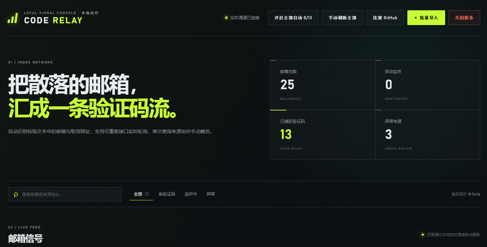
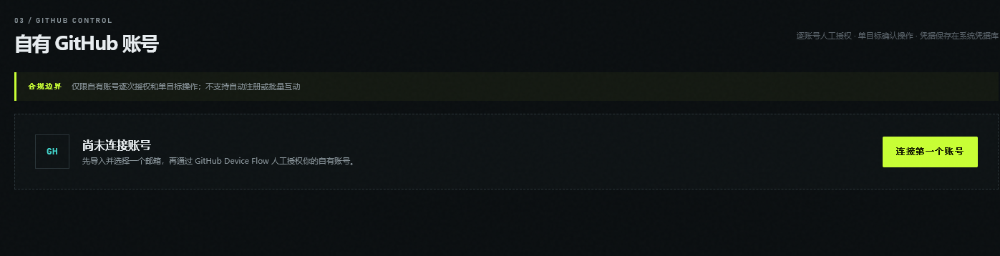

<p align="center">
  <a href="README.md"></a>
  <a href="README.zh-CN.md"></a>
  <a href="README.ja.md"></a>
</p>

# Code Relay

一个本地邮箱验证码聚合台，提供受约束的取信轮询，并辅助用户手动管理自己拥有的 GitHub 账号。






## 功能说明

Code Relay 在 `127.0.0.1:4173` 启动本地服务。它可以从粘贴的购买文本、TXT 或 CSV 中导入“邮箱 + 取信 URL”，轮询受支持的 HTTP/HTTPS 来源，提取可能的验证码，并通过 Server-Sent Events 实时更新浏览器页面。

- 配对并去重邮箱地址和取信 URL，支持同一行 `mailbox----url` 以及受支持的分行格式。
- 支持可重复轮询来源和受保护的一次性来源。
- 从纯文本、HTML、类 JSON 数据和 `iframe[srcdoc]` 邮件正文中提取验证码。
- 排除日期、时区偏移、邮箱账号片段和无关按钮文案等常见误码。
- 邮箱状态、来源 URL、邮件内容和验证码只保存在本地运行时存储中。
- 页面支持中文/英文切换，语言偏好保存在 `localStorage`。
- 使用 OAuth Device Flow 连接自有 GitHub 账号，Token 保存到操作系统凭据库。
- GitHub 写操作仅支持经过确认的单目标 `star`、`watch`、`fork` 和 `follow`。

Code Relay 不会注册 GitHub 账号、自动提交验证码、绕过 CAPTCHA 或风控，也不会执行批量或定时 GitHub 互动。

## 环境要求

- Node.js 20 或更高版本。
- npm（仓库包含 `package-lock.json`）。
- `v1.0.0` 的 EXE 和便携 ZIP 以 Windows 为目标。
- 仅在使用可选 GitHub 模块时需要 GitHub OAuth Client ID。可以在 UI 中填写，也可以设置 `GITHUB_OAUTH_CLIENT_ID`；取信功能不依赖它。

## 安装与运行

```powershell
npm install
npm start
```

访问 <http://127.0.0.1:4173>。Windows 用户也可以运行 `启动软件.cmd`，它会启动服务并打开浏览器。

`.env.example` 记录了可选环境值，但应用不会自动加载 `.env`。如需配置，请在启动前写入当前 Shell 环境。

导入示例：

```text
name@example.com----https://mail.example.com/api?token=YOUR_TOKEN

Click to fetch mailbox: https://mail.example.com/
qq mailbox:
1234567890@qq.com
```

同一行中的邮箱和 URL 必须在该行内配对。只有邮箱所在行没有 URL 时才使用跨行匹配，避免一条记录抢走下一条记录的来源。

## 运行配置

- `PORT` 修改本地监听端口；常规服务仍只绑定回环接口。
- `DATA_FILE` 覆盖 JSON 状态文件路径。该文件包含邮箱、取信 URL、消息和提取出的验证码，必须妥善保护。
- `GITHUB_OAUTH_CLIENT_ID` 可直接提供可选 OAuth 应用标识，无需通过 UI 保存。
- `CODE_RELAY_OPEN_BROWSER` 控制启动时是否自动打开本地页面。

这些变量必须在启动前写入当前进程环境。`.env.example` 记录了变量，但 Code Relay 没有引入 dotenv 加载器。

## 日常工作流

1. 启动服务并打开本地控制台。
2. 使用“批量导入”粘贴购买文本或载入支持的 TXT/CSV 来源，然后核对新增、更新、重复和拒绝数量。
3. 搜索或筛选邮箱卡片，并确认每个来源是可重复取信还是一次性取信；一次性来源必须保持为人工触发。
4. 可以刷新单个邮箱、刷新全部邮箱，或仅为符合条件的可重复来源启用自动轮询。Server-Sent Events 会在本地状态变化后更新页面。
5. 复制验证码前确认邮箱和消息上下文；不再需要本地数据时删除对应邮箱记录。
6. 可选 GitHub 流程中，先选择关联邮箱，通过 Device Flow 授权自有账号，再对单个目标执行一次明确确认的操作；断开账号会删除凭据库中的 Token。

## 测试

```powershell
npm test
```

测试使用 Node 内置测试运行器，覆盖导入配对、邮箱隔离、验证码提取、提供方解析、轮询、存储、HTTP 路由、GitHub 请求防护、凭据脱敏、全局刷新控制和历史误码清理。测试不得访问真实取信或 GitHub API。

当前没有配置 lint 或 format 命令。

## 打包 Windows 发布版

```powershell
npm run package
npm run sha256
```

项目没有前端编译步骤。Windows x64 EXE 使用 `@yao-pkg/pkg`，版本资源使用 `resedit`，便携 ZIP 由打包脚本调用 PowerShell `Compress-Archive` 生成。

`release-assets/` 中的预期文件：

| 文件 | 用途 |
| --- | --- |
| `code-relay-v1.0.0-win-x64.exe` | Windows x64 可执行文件 |
| `code-relay-v1.0.0-windows-portable.zip` | 包含 EXE、README、LICENSE、`.env.example` 和已验证演示图的便携包 |
| `SHA256SUMS.txt` | 发布文件 SHA256 校验值 |

项目没有安装器工程，因此不生成 MSI。发布说明位于 `PUBLISHING.md`；API 脚本把 `main` 和 `v1.0.0` 推送到 `NextWeb4/code-relay`，仅在运行时读取 `GITHUB_TOKEN` 或 `GH_TOKEN`，不会把 Token 写入 Git 配置。

## 项目结构

| 路径 | 职责 |
| --- | --- |
| `src/server.js` | 本地 HTTP/API/SSE 服务和关闭编排 |
| `src/parser.js` | 纯函数形式的邮箱/URL 导入解析 |
| `src/code-extractor.js` | 验证码与邮件消息提取 |
| `src/providers/` | 带安全限制的取信协议与响应解析 |
| `src/network-guard.js` | 外部取信 URL/网络限制 |
| `src/poller.js` | 轮询调度、并发和一次性来源处理 |
| `src/store.js` | 本地 JSON 持久化 |
| `src/github/` | Device Flow、凭据库、GitHub REST 客户端和单账号服务编排 |
| `public/` | 原生 HTML/CSS/JavaScript 页面；第三方请求必须经过本地 `/api` |
| `tests/` | Node 内置测试套件 |
| `scripts/` | Windows 打包、元数据、校验值、UI 验证和 Release 发布 |

## 数据与安全

- 从源码运行时，状态写入 `data/mailboxes.json`；打包版写入用户本机应用数据目录。
- `data/*.json`、`.env`、凭据、日志、构建产物和缓存均不应进入 Git。
- OAuth Token 只能通过 `@napi-rs/keyring` 保存；系统凭据库不可用时不得降级为明文文件。
- 取信请求拒绝不安全目标和重定向，具有超时与 2 MB 响应限制，并对展示 URL 中疑似 Token 的查询参数脱敏。
- 轮询默认值和防护限制无界并发；轮询间隔不得低于 5 秒。
- GitHub 写请求必须串行、单目标、明确确认，操作间隔至少 1 秒；遇到主限流、次级限流或 `Retry-After` 时必须停止并等待。
- 完整邮箱、来源 URL、验证码和邮件内容都是本地敏感数据，不应进入日志、截图、测试快照或提交。

## 维护与贡献

- 修改解析器、取信提供方、轮询、存储、GitHub 或浏览器边界前，请先阅读[架构说明](docs/architecture.md)，并在对应的 `tests/*.test.js` 中增加针对性覆盖。
- 浏览器端修改必须保留无需构建的原生前端，并同步维护中英文应用文案；文档修改必须保持三份 README 一致。
- 发布工作应遵循[发布审计](docs/release-audit.md)和[发布指南](PUBLISHING.md)，随后校验 EXE、便携包、演示图与校验值，且不得提交生成产物。
- 取信与 GitHub 操作必须保持手动、单一用途、感知限流，并遵守上文的安全边界。

## 作者

- HaoXiang Huang
- [Rays688888@Gmail.com](mailto:Rays688888@Gmail.com)
- <https://nextweb4.github.io/>
- <https://github.com/NextWeb4>

## 许可证

[MIT](LICENSE) © 2026 HaoXiang Huang。


